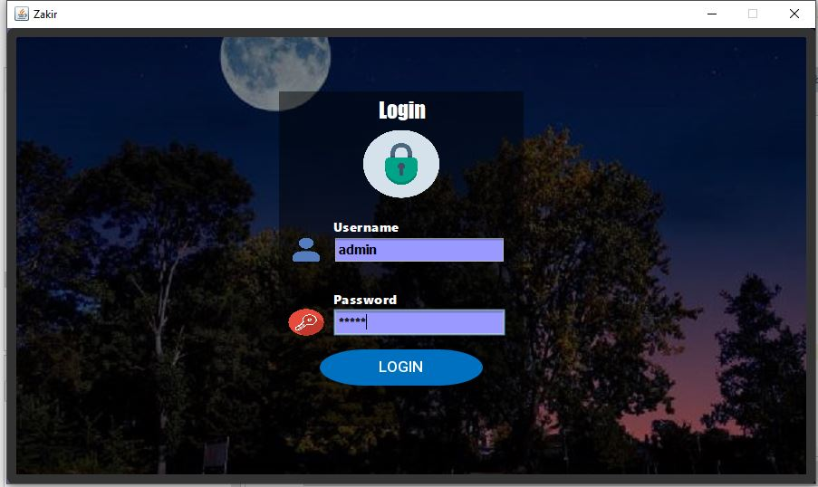
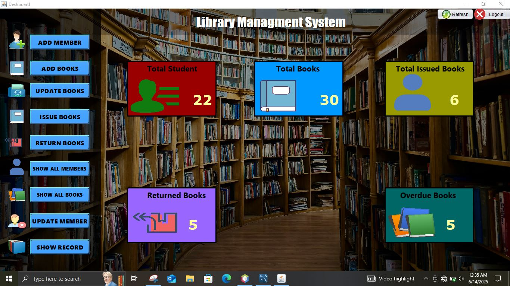
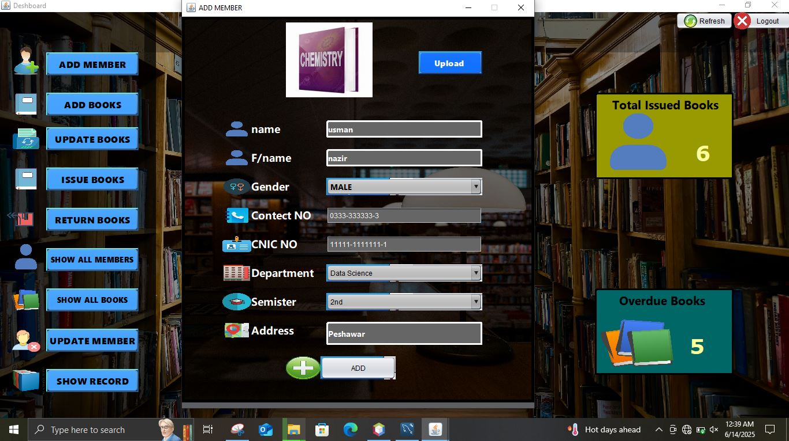
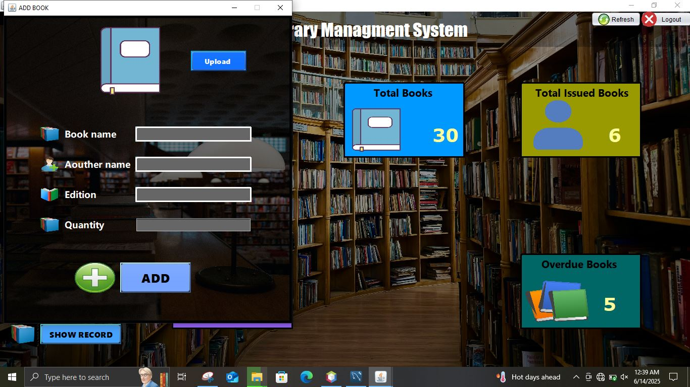
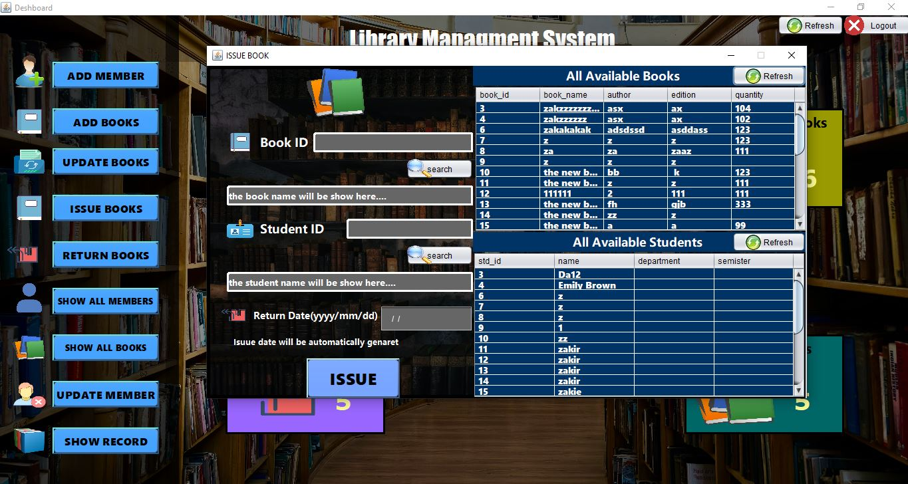
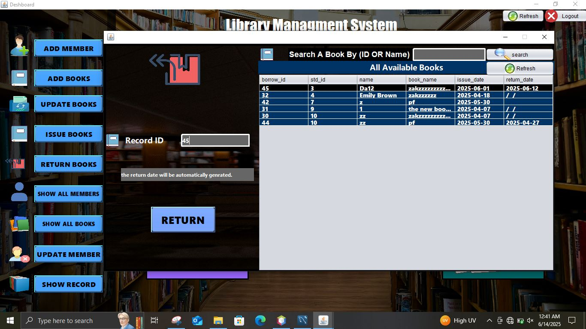
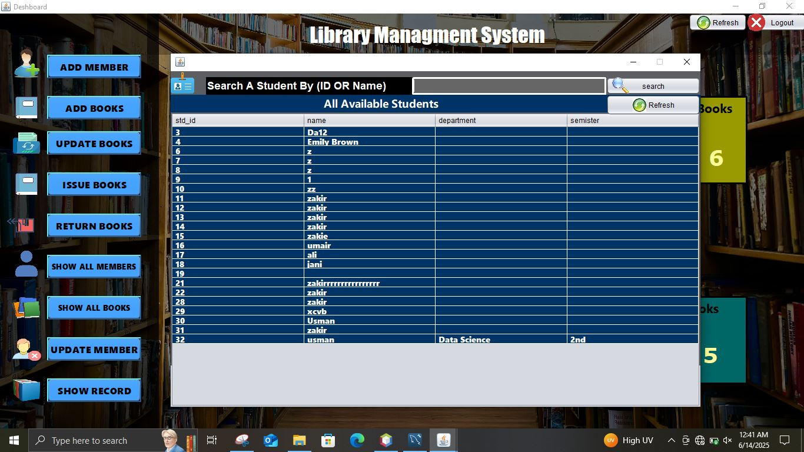
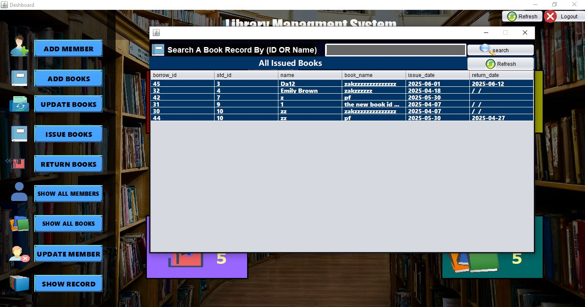

# Library Management System

A comprehensive Library Management System (LMS) built with Java Swing and MySQL database. This desktop application is designed to automate and streamline library operations including book management, member management, and book issuing/returning processes.

## 📋 Table of Contents

- [Features](#features)
- [Screenshots](#screenshots)
- [Technology Stack](#technology-stack)
- [Prerequisites](#prerequisites)
- [Installation & Setup](#installation--setup)
- [Database Configuration](#database-configuration)
- [Usage](#usage)
- [Project Structure](#project-structure)
- [Contributing](#contributing)
- [License](#license)

## ✨ Features

### 📚 Book Management
- Add new books with details (name, author, edition, quantity)
- Update existing book information
- View all books in the library
- Delete books from the system
- Book profile picture support

### 👥 Member Management
- Register new library members
- Update member information
- View all registered members
- Member profile picture support
- Store contact details, department, and semester information

### 📖 Book Transaction Management
- Issue books to members
- Return books functionality
- Track borrowing history
- Maintain issue and return dates
- View borrowing records

### 🏛️ Library Administration
- Secure admin login system
- Dashboard with statistics overview
- Library customization (title, logo)
- Complete transaction tracking

## 📸 Screenshots

### Main Dashboard


### Login System


### Book Management


### Member Management


### Book Issue Process


### Book Return Process


### All Books View


### All Members View


### Borrowing Records


## 🛠️ Technology Stack

- **Frontend**: Java Swing (GUI)
- **Backend**: Java SE
- **Database**: MySQL
- **Build Tool**: Apache NetBeans (Ant)
- **JDBC Driver**: MySQL Connector/J 9.2.0

## 📋 Prerequisites

Before running this application, ensure you have the following installed:

- **Java Development Kit (JDK)** 8 or higher
- **MySQL Server** 5.7 or higher
- **MySQL Connector/J** (included in the project)
- **Apache NetBeans IDE** (recommended) or any Java IDE

## 🚀 Installation & Setup

### 1. Clone the Repository
```bash
git clone https://github.com/realusmannazir1/Library-Management-System.git
cd Library-Management-System
```

### 2. Database Setup
1. Start your MySQL server
2. Create the database and tables using the provided SQL script:
   ```sql
   source db.txt
   ```
   Or manually execute the SQL commands in `db.txt`

### 3. Configure Database Connection
Update the database connection details in `src/Library/ConnectionTest.java`:
```java
String url = "jdbc:mysql://localhost:3306/login";
String user = "your_mysql_username";
String password = "your_mysql_password";
```

### 4. Build and Run
#### Using NetBeans:
1. Open the project in NetBeans
2. Build the project (F11)
3. Run the project (F6)

#### Using Command Line:
```bash
# Compile the project
javac -cp "mysql-connector-j-9.2.0.jar" src/Library/*.java

# Run the application
java -cp ".:mysql-connector-j-9.2.0.jar:src" Library.Login
```

## 🗄️ Database Configuration

The application uses MySQL database with the following tables:

- **admin**: Stores administrator credentials
- **books**: Contains book information and inventory
- **members**: Stores library member details
- **issue_books**: Tracks book borrowing transactions
- **return_book**: Records book returns
- **librarydetails**: Stores library configuration

### Default Admin Credentials
- Username: `admin`
- Password: `admin123`

## 🎯 Usage

1. **Login**: Start the application and login with admin credentials
2. **Dashboard**: View library statistics and navigate to different modules
3. **Add Books**: Navigate to book management to add new books
4. **Register Members**: Add new library members with their details
5. **Issue Books**: Select a member and book to create an issue transaction
6. **Return Books**: Process book returns and update inventory
7. **View Records**: Monitor all transactions and member activities

## 📁 Project Structure

```
Library-Management-System/
├── src/
│   ├── Library/              # Main application package
│   │   ├── Login.java        # Login form and authentication
│   │   ├── Dashboard.java    # Main dashboard
│   │   ├── Add_book.java     # Book addition functionality
│   │   ├── Add_member.java   # Member registration
│   │   ├── issue_book.java   # Book issuing process
│   │   ├── return_book.java  # Book return process
│   │   ├── Show_all_books.java    # Display all books
│   │   ├── Show_all_member.java   # Display all members
│   │   ├── Update_book.java       # Book update functionality
│   │   ├── Update_member.java     # Member update functionality
│   │   ├── borrow_record.java     # Borrowing history
│   │   └── ConnectionTest.java    # Database connection
│   ├── icons/                # Application icons
│   ├── back_photo/          # Background images
│   └── photo/               # Additional images
├── mysql-connector-j-9.2.0/ # MySQL JDBC driver
├── build.xml                # Ant build configuration
├── db.txt                   # Database schema
└── README.md               # This file
```

## 🤝 Contributing

Contributions are welcome! Please feel free to submit a Pull Request. For major changes, please open an issue first to discuss what you would like to change.

1. Fork the project
2. Create your feature branch (`git checkout -b feature/AmazingFeature`)
3. Commit your changes (`git commit -m 'Add some AmazingFeature'`)
4. Push to the branch (`git push origin feature/AmazingFeature`)
5. Open a Pull Request

## 🙏 Acknowledgments

- Thanks to all contributors who helped build this project
- Icons provided by [Icons8](https://icons8.com/)
- Background images from [Unsplash](https://unsplash.com/)

---

**Note**: This is a desktop application built for educational purposes. For production use, consider implementing additional security measures and error handling.
